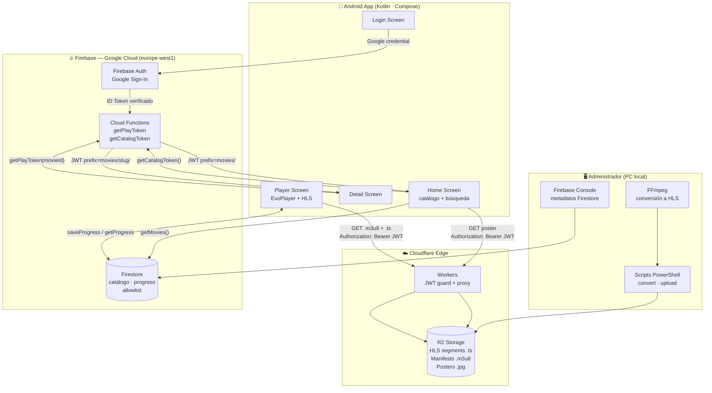
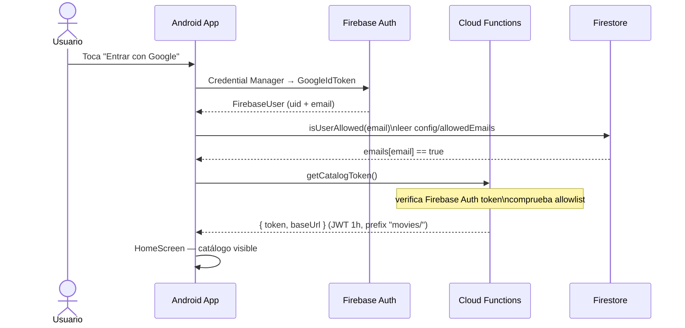
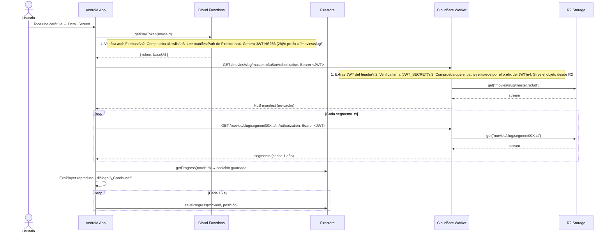

# Lucy Movies 🎬

Plataforma de streaming privada para familia. Las películas se almacenan en la nube y se reproducen en la app Android sin necesidad de servidores propios que mantener.

---

## Tabla de contenidos

- [Arquitectura general](#arquitectura-general)
- [Flujos principales](#flujos-principales)
- [Componentes](#componentes)
  - [Android App](#1--android-app)
  - [Cloudflare Worker + R2](#2--cloudflare-worker--r2)
  - [Firebase](#3--firebase)
  - [Scripts de administración](#4--scripts-de-administración)
- [Modelo de seguridad](#modelo-de-seguridad)
- [Estructura del proyecto](#estructura-del-proyecto)
- [Agregar una película](#agregar-una-película)

---

## Arquitectura general

El sistema no tiene servidor propio. Está construido 100% sobre servicios gestionados: **Cloudflare** para almacenamiento y entrega del video, **Firebase** para autenticación, base de datos y lógica de negocio, y una **app Android nativa** como cliente.



---

## Flujos principales

### Autenticación y verificación de acceso



### Reproducción de una película



---

## Componentes

### 1 · Android App

**Ubicación:** `android-app/`
**Lenguaje:** Kotlin · Jetpack Compose · Material 3
**Min SDK:** 26 (Android 8) · Target SDK: 35

#### Stack de la app

| Librería | Versión | Uso |
|----------|---------|-----|
| Compose BOM | 2026.01.01 | UI declarativa |
| Media3 / ExoPlayer | 1.6.1 | Reproductor HLS con headers JWT |
| Firebase BOM | 33.9.0 | Auth + Firestore + Functions |
| Credentials + GoogleId | 1.5.0 / 1.1.1 | Google Sign-In moderno (no legacy) |
| Coil | 2.7.0 | Carga de carátulas con header JWT |
| Navigation Compose | 2.8.9 | Navegación entre pantallas |
| Lifecycle ViewModel | 2.9.0 | Estado sobrevive rotaciones |

#### Pantallas y responsabilidades

```
MainActivity
└── AppNavGraph
    ├── LoginScreen        → Google Sign-In via Credential Manager
    ├── HomeScreen         → catálogo con búsqueda y filtros por categoría
    ├── MovieDetailScreen  → poster grande, metadatos, botón reproducir
    └── PlayerScreen       → ExoPlayer custom controls
                              · doble tap ±10 s
                              · auto-hide 3 s
                              · seek bar + play/pause
                              · gestos volumen (derecha) / brillo (izquierda)
                              · bloqueo de pantalla
                              · progreso guardado en Firestore
```

#### Capa de datos

```
data/
├── auth/AuthRepository.kt          → Google Sign-In → Firebase credential
├── firestore/FirestoreRepository.kt → getMovies · isUserAllowed · saveProgress · getProgress
└── player/PlayTokenRepository.kt   → llama a getPlayToken / getCatalogToken
```

#### Pieza crítica: ExoPlayer con JWT

El header `Authorization: Bearer <token>` se inyecta a nivel de `DefaultHttpDataSource.Factory`, lo que garantiza que **todos** los requests (manifest `.m3u8` y cada segmento `.ts`) incluyan el token. Sin esto, el Worker rechaza con 401.

```kotlin
val factory = DefaultHttpDataSource.Factory()
    .setDefaultRequestProperties(mapOf("Authorization" to "Bearer $token"))
val source = HlsMediaSource.Factory(factory)
    .createMediaSource(MediaItem.fromUri(manifestUrl))
```

---

### 2 · Cloudflare Worker + R2

**Ubicación:** `cloudflare-worker/`
**Runtime:** Cloudflare Workers (edge, V8 isolates, sin Node.js)
**Storage:** Cloudflare R2 (compatible S3, sin egress fees)

#### Qué hace el Worker

El Worker es el único punto de acceso al contenido. Actúa como **guardia JWT + proxy a R2**:

```
Request → [1. ¿Tiene Bearer token?]
              ↓ No → 401 Unauthorized
          [2. ¿JWT válido? (verifica firma con JWT_SECRET)]
              ↓ No → 401 Invalid token
          [3. ¿El path solicitado empieza por el prefix del JWT?]
              ↓ No → 403 Forbidden
          [4. ¿Existe el objeto en R2?]
              ↓ No → 404 Not Found
          → Sirve el objeto con Content-Type y Cache-Control correctos
```

#### Cache-Control por tipo de archivo

| Archivo | Cache | Motivo |
|---------|-------|--------|
| `*.m3u8` | `no-cache, no-store` | El manifest puede actualizarse |
| `*.ts` | `public, max-age=31536000, immutable` | Los segmentos nunca cambian |
| `*.jpg / *.png` | `public, max-age=31536000, immutable` | Las carátulas son estáticas |

#### Estructura en R2

```
family-movies-media/          ← bucket R2
└── movies/
    ├── zootopia-2/
    │   ├── master.m3u8       ← manifest principal
    │   ├── segment000.ts
    │   ├── segment001.ts
    │   ├── ...
    │   └── poster.jpg
    ├── frozen/
    │   └── ...
    └── moana-2/
        └── ...
```

#### Variables de entorno del Worker

| Variable | Tipo | Descripción |
|----------|------|-------------|
| `JWT_SECRET` | Secret (Wrangler) | Clave HS256 compartida con Cloud Functions |
| `MEDIA` | R2 Binding | Referencia al bucket `family-movies-media` |

---

### 3 · Firebase

**Proyecto:** `lucy-movies`
**Región de Functions:** `europe-west1` (obligatorio — acerca la latencia a Europa)

#### Firebase Auth

- Proveedor: **Google Sign-In** vía Credential Manager (Android Jetpack)
- Genera un Firebase ID Token que se envía a todas las Cloud Functions
- El email del usuario es la clave de la allowlist

#### Firestore

Estructura de colecciones:

```
firestore/
├── config/
│   └── allowedEmails          ← documento de configuración
│       └── emails: Map<String, Boolean>
│           ├── "lucia@gmail.com": true
│           └── "jorge@gmail.com": true
│
├── movies/                    ← catálogo de películas
│   └── {slug}/                ← ID = slug (ej. "zootopia-2")
│       ├── title: String      "Zootopia 2"
│       ├── manifestPath: String  "movies/zootopia-2/master.m3u8"
│       ├── posterPath: String    "movies/zootopia-2/poster.jpg"
│       ├── category: String   "animacion"
│       ├── year: Number       2025
│       └── duration: Number   107
│
└── progress/
    └── {uid}/
        └── movies/
            └── {movieId}/
                └── positionMs: Number   ← posición guardada en milisegundos
```

#### Cloud Functions

**`getPlayToken(movieId)`** — JWT de reproducción
- Verifica que el usuario esté autenticado en Firebase
- Comprueba que su email esté en `config/allowedEmails`
- Lee `manifestPath` de `movies/{movieId}`
- Genera JWT HS256 con `exp = ahora + 2h` y `prefix = "movies/slug/"`
- Retorna `{ token, baseUrl }`

**`getCatalogToken()`** — JWT para carátulas
- Mismas verificaciones de auth y allowlist
- Genera JWT con `exp = ahora + 1h` y `prefix = "movies/"` (acceso a todos los posters)
- Retorna `{ token, baseUrl }`

#### ¿Por qué dos tokens distintos?

| Token | Prefix | Validez | Alcance |
|-------|--------|---------|---------|
| Catálogo | `movies/` | 1 hora | Solo posters (`.jpg`) de cualquier película |
| Reproducción | `movies/slug/` | 2 horas | Todo el contenido de una película concreta |

Así, aunque alguien interceptara el token de catálogo, **no podría reproducir ningún video**. Solo ve imágenes.

---

### 4 · Scripts de administración

**Ubicación:** `scripts/`
**Plataforma:** Windows PowerShell + FFmpeg + Wrangler CLI

#### `convert-to-hls.ps1`

Convierte el archivo de video a formato HLS usando FFmpeg:

```
Input: película.mp4 o película.mkv
Output: scripts/output/{slug}/
        ├── master.m3u8
        ├── segment000.ts
        └── ...
```

Decisiones técnicas clave:
- **Video:** `-c:v copy` — copia el stream de video sin re-codificar (muy rápido, sin pérdida de calidad)
- **Audio:** `-c:a aac -b:a 192k -ac 2` — convierte siempre a AAC estéreo, incluso desde Dolby Atmos o EAC3 que ExoPlayer en Android no soporta
- **Mapa de streams:** `-map 0:v:0 -map 0:a:0` — selecciona solo video y audio principal, descarta subtítulos y pistas extra
- **Segmentos:** duración estándar de 6 segundos (valor por defecto de HLS)

#### `upload-hls-to-r2.ps1`

Sube todos los archivos del output al bucket R2 usando Wrangler:

```
Destino en R2: movies/{slug}/segment000.ts, master.m3u8, poster.jpg, ...
```

Características:
- **Resume automático:** guarda en `upload-progress-{slug}.log` qué archivos ya se subieron; si se corta la conexión, continúa desde donde quedó
- **Reintentos:** 3 intentos por archivo con 3 s de pausa ante errores de red
- **Filtrado:** omite archivos `.vtt` (subtítulos generados por FFmpeg que no se usan)
- **Progreso:** muestra `[23/1078] movies/slug/segment022.ts`

---

## Modelo de seguridad

### Capas de protección

```
┌─────────────────────────────────────────────────────────────────┐
│  Capa 1: Firebase Auth                                           │
│  El usuario debe estar autenticado con Google.                  │
│  Sin sesión = sin acceso a ninguna función ni dato.             │
└─────────────────────────────────────────────────────────────────┘
                              ↓
┌─────────────────────────────────────────────────────────────────┐
│  Capa 2: Allowlist (Firestore config/allowedEmails)             │
│  Solo los emails explícitamente listados pueden usar la app.    │
│  Control granular: agregar o revocar acceso en segundos.        │
└─────────────────────────────────────────────────────────────────┘
                              ↓
┌─────────────────────────────────────────────────────────────────┐
│  Capa 3: JWT con prefix (Cloudflare Worker)                     │
│  Cada token da acceso solo a un path específico en R2.          │
│  Expira en 1-2h. Firmado con HS256 (JWT_SECRET).               │
│  El Worker valida firma + expiracion + prefix en cada request.  │
└─────────────────────────────────────────────────────────────────┘
                              ↓
┌─────────────────────────────────────────────────────────────────┐
│  Capa 4: R2 Storage sin acceso público                          │
│  El bucket no tiene URL pública. Solo el Worker puede leerlo.   │
│  El Worker solo lo hace si el JWT es válido.                    │
└─────────────────────────────────────────────────────────────────┘
```

### Secrets y configuración sensible

| Secret | Donde vive | Cómo se configura |
|--------|-----------|-------------------|
| `JWT_SECRET` | Cloudflare Workers + Firebase Functions | `wrangler secret put JWT_SECRET` / Firebase secrets |
| `google-services.json` | Solo en el PC de desarrollo | Descarga desde Firebase Console, no va al repo |
| `local.properties` (keystore) | Solo en el PC de desarrollo | No va al repo (en `.gitignore`) |
| Web Client ID (OAuth) | Hardcoded en `AuthRepository.kt` | Valor público, no es un secreto |

---

## Estructura del proyecto

```
family-movies/
│
├── android-app/                         ← App Android (Kotlin + Compose)
│   └── app/src/main/java/com/familymovies/app/
│       ├── MainActivity.kt
│       ├── navigation/AppNavGraph.kt
│       ├── data/
│       │   ├── auth/AuthRepository.kt         → Google Sign-In
│       │   ├── firestore/FirestoreRepository.kt → catálogo + progreso
│       │   └── player/PlayTokenRepository.kt  → tokens JWT
│       └── ui/
│           ├── theme/                         → colores, tipografía
│           ├── common/FunBackground.kt        → fondo animado con estrellas
│           ├── login/LoginScreen.kt + ViewModel
│           ├── home/HomeScreen.kt + ViewModel → catálogo + búsqueda
│           ├── detail/MovieDetailScreen.kt    → ficha de la película
│           └── player/PlayerScreen.kt         → reproductor custom
│
├── cloudflare-worker/                   ← Worker (JWT guard + proxy R2)
│   ├── src/index.js                     → lógica del Worker
│   └── wrangler.toml                    → configuración (binding R2, nombre)
│
├── backend/                             ← Firebase Cloud Functions
│   ├── functions/index.js               → getPlayToken + getCatalogToken
│   └── firestore.rules                  → reglas de acceso a Firestore
│
├── scripts/                             ← Herramientas de administración
│   ├── convert-to-hls.ps1               → FFmpeg: video → HLS
│   └── upload-hls-to-r2.ps1             → Wrangler: subir a R2 con resume
│
└── docs/
    └── agregar-pelicula.md              → guía paso a paso para subir una peli
```

---

## Agregar una película

Ver la guía completa en [`docs/agregar-pelicula.md`](docs/agregar-pelicula.md).

Resumen del proceso:

```
1. Elegir slug  →  "moana-2"
2. cd scripts && .\convert-to-hls.ps1       (FFmpeg: mp4/mkv → HLS)
3. .\upload-hls-to-r2.ps1                   (Wrangler: sube a R2 + poster)
4. Firebase Console → Firestore → movies → nuevo doc con el slug
5. App → pull to refresh → verificar carátula y reproducción
6. Borrar scripts/output/moana-2            (opcional, liberar disco)
```

> **No es necesario actualizar ni recompilar la app** cuando se agrega una película nueva. El catálogo se carga desde Firestore en tiempo real.
